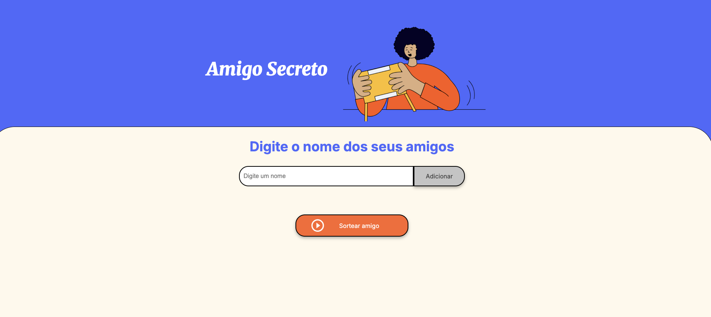

# Sorteio de Amigo Secreto

👉 Você pode acessar o projeto clicando no badge acima.

## 👀 Preview
Este projeto foi desenvolvido com fins educacionais.

Este projeto faz parte de um **challenge** proposto pelo curso da **Alura em parceria com a Oracle**, e tem como objetivo fornecer uma forma simples e intuitiva de realizar sorteios de amigos secretos utilizando apenas o navegador. Neste desafio colocaremos em prática conceitos fundamentais de **lógica de programação**, como variáveis, condicionais, funções, listas e loops de repetição. Esses conceitos constituem a base de qualquer linguagem de programação, independentemente de sua complexidade.

O projeto foi desenvolvido com **HTML** e **JavaScript**, utilizando conceitos básicos de manipulação do DOM para permitir que usuários adicionem nomes, visualizem a lista de participantes e realizem sorteios de forma aleatória.

O código é pensado para ser compreensível e fácil de utilizar, servindo tanto como ferramenta prática quanto como exemplo didático de programação em JavaScript.

---

## 🎯 Objetivo

O principal propósito do projeto é demonstrar como funções simples podem ser combinadas para criar uma aplicação interativa que:

- Adiciona nomes de participantes à lista.
- Exibe dinamicamente a lista de amigos adicionados.
- Sorteia aleatoriamente um participante como “amigo secreto”.
- Limpa a lista após cada sorteio, permitindo novos sorteios sem duplicações.

---

## 🛠️ Tecnologias e Conceitos

- **JavaScript Vanilla**: manipulação de arrays e elementos do DOM.
- **HTML**: estrutura da página.
- **Conceitos de lógica e aleatoriedade**: o sorteio é realizado de forma randômica, garantindo imparcialidade.

---

## 🚀 Como Funciona

1. O usuário insere o nome de cada amigo no campo de texto.  
2. Ao clicar em **Adicionar**, o nome é exibido na lista de participantes.  
3. Após adicionar todos os nomes, basta clicar em **Sortear**.  
4. O sistema seleciona aleatoriamente um nome e exibe o resultado na tela.  
5. A lista é limpa automaticamente para permitir novos sorteios.  

---

## 📌 Considerações

Este projeto demonstra como aplicações simples podem ser desenvolvidas de forma clara e eficiente, sendo útil como referência para iniciantes em programação ou como ferramenta prática para pequenos grupos que desejam realizar sorteios de amigos secretos.  

